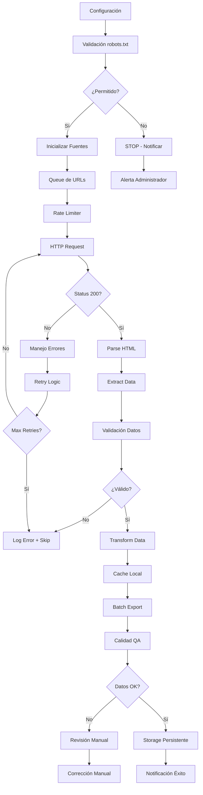

# Plan de Scraping - Estrategia y Arquitectura

## Objetivo de Negocio

### Propósito Principal
- **Meta**: Extraer datos estructurados de fuentes web públicas para análisis de founders/startups
- **Valor**: Proveer dataset limpio y actualizado para investigación académica/empresarial
- **Frecuencia**: Scraping semanal con actualización incremental
- **Volumen**: ~10,000-50,000 registros por ciclo inicial, ~1,000-5,000 incremental

### Casos de Uso
1. **Investigación Académica**: Análisis de ecosistemas de startups
2. **Networking**: Identificación de founders por industria/ubicación
3. **Tendencias**: Mapeo de crecimiento sectorial
4. **Benchmarking**: Comparación entre diferentes mercados

### Métricas de Éxito
- ✅ **Cobertura**: >90% de fuentes objetivo scrapeadas exitosamente
- ✅ **Calidad**: <5% de campos vacíos en registros esenciales
- ✅ **Frecuencia**: Actualizaciones dentro de ventana de 24h
- ✅ **Estabilidad**: <2% de fallos en producción

---

## Fuentes de Datos

### Fuentes Primarias (Sitios Objetivo)
```yaml
fuentes:
  - nombre: "Crunchbase"
    url: "https://www.crunchbase.com"
    tipo: "Directorio de startups"
    frecuencia: "Semanal"
    prioridad: "Alta"
    estimacion_registros: "15,000"
    
  - nombre: "AngelList"
    url: "https://angel.co"
    tipo: "Plataforma de networking"
    frecuencia: "Semanal"
    prioridad: "Alta"
    estimacion_registros: "12,000"
    
  - nombre: "Product Hunt"
    url: "https://www.producthunt.com"
    tipo: "Catálogo de productos"
    frecuencia: "Diaria"
    prioridad: "Media"
    estimacion_registros: "8,000"
    
  - nombre: "GitHub Trending"
    url: "https://github.com/trending"
    tipo: "Repositorios populares"
    frecuencia: "Diaria"
    prioridad: "Media"
    estimacion_registros: "5,000"
```

### Fuentes Secundarias (Validación Cruzada)
```yaml
validacion:
  - nombre: "LinkedIn"
    proposito: "Validación de perfiles profesionales"
    uso: "Verificación de datos de founders"
    
  - nombre: "Twitter/X"
    proposito: "Actividad y presencia social"
    uso: "Enriquecimiento de datos"
    
  - nombre: "Company Websites"
    proposito: "Información oficial de empresas"
    uso: "Validación de datos corporativos"
```

### Supuestos Técnicos
```yaml
supuestos:
  accesibilidad:
    - "Sitios permiten acceso vía HTTP sin autenticación"
    - "No requieren captcha en modo básico"
    - "Rate limiting configurable por sitio"
    
  estructura:
    - "HTML semánticamente correcto"
    - "Selectores CSS estables"
    - "Paginación consistente"
    
  datos:
    - "Campos requeridos disponibles en >80% de registros"
    - "Fechas en formato ISO o parseable"
    - "URLs válidas y accesibles"
```

---

## Pipeline de Scraping

### Diagrama de Flujo (Mermaid)


### Fases del Pipeline

#### 1. **Preparación (5-10 min)**
```python
# Verificación inicial
def preparar_scraping():
    verificar_robots_txt()
    validar_configuracion()
    inicializar_logs()
    preparar_directorios()
```

#### 2. **Extracción (Variable: 2-6 horas)**
```python
# Bucle principal de scraping
def ejecutar_scraping():
    for fuente in fuentes_configuradas:
        urls = generar_urls(fuente)
        for url in urls:
            datos = scrapear_url(url)
            procesar_datos(datos)
            aplicar_rate_limit()
```

#### 3. **Transformación (15-30 min)**
```python
# Limpieza y normalización
def transformar_datos(raw_data):
    limpiar_campos()
    normalizar_formatos()
    deduplicar()
    enriquecer_datos()
```

#### 4. **Validación (10-20 min)**
```python
# QA automático
def validar_calidad(data):
    verificar_completitud()
    validar_formatos()
    detectar_outliers()
    comparar_con_fuentes()
```

#### 5. **Exportación (5-15 min)**
```python
# Generación de outputs
def exportar_resultados(data):
    generar_csv()
    generar_json()
    generar_excel()
    actualizar_metadatos()
```

---

## Responsabilidades por Componente

### Equipo de Desarrollo
| Componente | Responsable | Backup |
|------------|-------------|--------|
| **Scraper Core** | Dev 1 | Dev 2 |
| **Rate Limiting** | Dev 2 | Dev 1 |
| **Data Validation** | Dev 1 | Dev 3 |
| **Export Logic** | Dev 3 | Dev 1 |
| **Error Handling** | Dev 2 | Dev 3 |

### Responsabilidades Técnicas

#### **Scraper Principal**
```python
class ScraperManager:
    def __init__(self):
        self.fuentes = []
        self.rate_limiter = RateLimiter()
        self.error_handler = ErrorHandler()
        self.data_processor = DataProcessor()
```

#### **Gestión de Fuentes**
```python
class FuenteManager:
    def __init__(self):
        self.fuentes_activas = {}
        self.configuraciones = {}
        self.estadisticas = {}
```

#### **Control de Calidad**
```python
class QualityAssurance:
    def __init__(self):
        self.validadores = []
        self.reportes = {}
        self.umbral_calidad = 0.85
```

---

## Observabilidad y Monitoreo

### Estructura de Logs

#### **Log Levels**
```python
import logging

# Configuración de logging
LOGGING_CONFIG = {
    'version': 1,
    'disable_existing_loggers': False,
    'formatters': {
        'detailed': {
            'format': '[{asctime}] {levelname:8} {name:30} {funcName:20} - {message}',
            'style': '{',
        },
        'simple': {
            'format': '[{levelname}] {message}',
            'style': '{',
        },
    },
    'handlers': {
        'console': {
            'class': 'logging.StreamHandler',
            'level': 'INFO',
            'formatter': 'simple',
        },
        'file': {
            'class': 'logging.handlers.RotatingFileHandler',
            'filename': 'logs/scraper.log',
            'maxBytes': 10485760,  # 10MB
            'backupCount': 5,
            'level': 'DEBUG',
            'formatter': 'detailed',
        },
        'error_file': {
            'class': 'logging.handlers.RotatingFileHandler',
            'filename': 'logs/errors.log',
            'maxBytes': 10485760,
            'backupCount': 3,
            'level': 'ERROR',
            'formatter': 'detailed',
        },
    },
    'loggers': {
        '': {  # root logger
            'handlers': ['console', 'file', 'error_file'],
            'level': 'DEBUG',
            'propagate': False,
        }
    }
}
```

#### **Eventos de Log Importantes**
```python
# Ejemplos de logging estructurado
logger.info("Iniciando scraping de fuente", extra={
    'fuente': 'crunchbase',
    'url_count': len(urls),
    'timestamp': datetime.utcnow().isoformat()
})

logger.warning("Rate limit detectado", extra={
    'fuente': 'angellist',
    'status_code': 429,
    'retry_after': response.headers.get('Retry-After')
})

logger.error("Fallo en extracción", extra={
    'url': url,
    'error_type': type(e).__name__,
    'attempt': attempt,
    'max_attempts': max_retries
})

logger.info("Datos extraídos exitosamente", extra={
    'records_count': len(datos),
    'processing_time': elapsed_time,
    'success_rate': success_rate
})
```

### Métricas de Observabilidad

#### **Métricas de Negocio**
```python
BUSINESS_METRICS = {
    'total_records_extracted': 0,
    'unique_companies_found': 0,
    'data_quality_score': 0.0,
    'sources_coverage_percentage': 0.0,
    'processing_duration_minutes': 0,
    'cost_per_record': 0.0
}
```

#### **Métricas Técnicas**
```python
TECHNICAL_METRICS = {
    'http_requests_total': 0,
    'http_requests_success': 0,
    'http_requests_failed': 0,
    'average_response_time': 0.0,
    'rate_limit_hits': 0,
    'parser_errors': 0,
    'validation_failures': 0,
    'retry_attempts': 0
}
```

#### **Alertas Configuradas**
```yaml
alertas:
  criticas:
    - "Tasa de éxito < 80%"
    - "Error rate > 10% por 15 min"
    - "Sin datos nuevos por > 2 horas"
    
  warnings:
    - "Rate limit frecuentes"
    - "Response time > 5s promedio"
    - "Campo vacío > 15%"
    
  info:
    - "Scraping completado"
    - "Nueva fuente detectada"
    - "Actualización incremental exitosa"
```

---

## Manejo de Errores

### Clasificación de Errores

#### **Errores Transitorios (Retry Automático)**
- Timeouts de red
- Errores 5xx del servidor
- Conexiones caídas
- Rate limiting temporal

```python
class TransientError(Exception):
    """Errores que pueden resolverse con retry"""
    pass

def manejar_error_transitorio(error, attempt, max_retries):
    if attempt < max_retries:
        delay = calcular_backoff(attempt)
        logger.warning(f"Retry {attempt}/{max_retries} en {delay}s", extra={
            'error': str(error),
            'delay': delay
        })
        time.sleep(delay)
        return True
    return False
```

#### **Errores Permanentes (Skip con Log)**
- HTTP 404/410
- Selectores no encontrados
- Datos inválidos irreversibles
- robots.txt restrictivo

```python
class PermanentError(Exception):
    """Errores que requieren intervención manual"""
    pass

def manejar_error_permanente(error, url):
    logger.error("Error permanente, saltando URL", extra={
        'url': url,
        'error': str(error),
        'action': 'skipped'
    })
    # Registrar en lista de URLs problemáticas para revisión
    problematic_urls.append(url)
```

#### **Errores Críticos (Stop del Proceso)**
- Credenciales inválidas
- API keys expiradas
- Configuración corrupta
- Dependencias faltantes

```python
class CriticalError(Exception):
    """Errores que detienen el proceso"""
    pass

def manejar_error_critico(error):
    logger.critical("Error crítico detectado", extra={
        'error': str(error),
        'action': 'stopping_process'
    })
    # Notificar inmediatamente al equipo
    enviar_alerta_critica(error)
    sys.exit(1)
```

### Estrategia de Recuperación

#### **Checkpoint y Resume**
```python
class CheckpointManager:
    def __init__(self):
        self.checkpoint_file = "logs/checkpoint.json"
        self.estado_actual = {}
    
    def guardar_checkpoint(self, progreso):
        self.estado_actual = {
            'timestamp': datetime.utcnow().isoformat(),
            'urls_procesadas': progreso['processed_urls'],
            'datos_extraidos': progreso['extracted_data'],
            'fuente_actual': progreso['current_source'],
            'estadisticas': progreso['metrics']
        }
        
        with open(self.checkpoint_file, 'w') as f:
            json.dump(self.estado_actual, f, indent=2)
    
    def cargar_checkpoint(self):
        if os.path.exists(self.checkpoint_file):
            with open(self.checkpoint_file, 'r') as f:
                return json.load(f)
        return {}
```

#### **Resumir Scraping Interrumpido**
```python
def reanudar_scraping():
    checkpoint = CheckpointManager().cargar_checkpoint()
    
    if checkpoint:
        logger.info("Reanudando desde checkpoint", extra={
            'timestamp': checkpoint['timestamp'],
            'processed_urls': len(checkpoint['urls_procesadas'])
        })
        
        # Continuar desde donde se dejó
        urls_restantes = filtrar_urls_procesadas(checkpoint['urls_procesadas'])
        return urls_restantes
    
    return inicializar_urls()  # Primera vez
```

---

## Escalabilidad y Performance

### Optimizaciones Implementadas
- **Concurrent Requests**: Hasta 5 requests simultáneos
- **Connection Pooling**: Reutilizar conexiones HTTP
- **Caching**: Cache local de respuestas por 24h
- **Chunking**: Procesar datos en lotes de 100 registros

### Limits de Recursos
- **CPU**: <70% durante scraping
- **Memory**: <2GB RAM total
- **Network**: <10Mbps bandwidth
- **Storage**: <500MB datos temporales

---

## Próximos Pasos

1. **Implementar scraper base** con rate limiting
2. **Configurar sistema de logs** y métricas
3. **Desarrollar validadores** de datos
4. **Crear sistema de alertas** para errores críticos
5. **Establecer pipeline de CI/CD** para updates

---

**Última actualización**: 15 de noviembre de 2025
**Responsable**: Equipo de Desarrollo